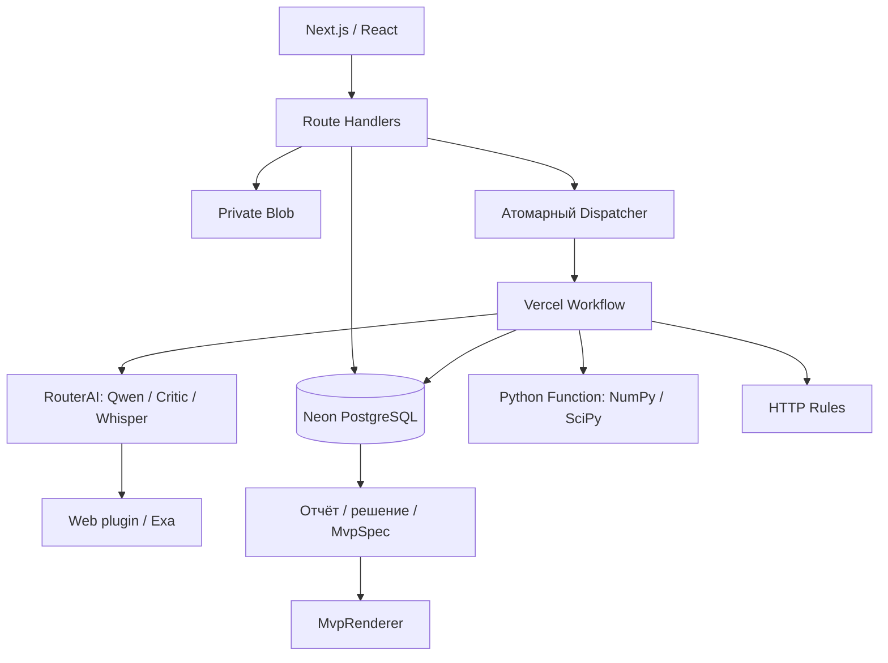

# Архитектура v1.3

Neon хранит бизнес-состояние, очередь, версии, результаты и ExecutionLog. Workflow управляет долговременным выполнением, но не заменяет БД. Dispatcher атомарно запускает одно тяжёлое задание с приоритетом, FIFO и aging. UI получает прогресс polling раз в 3 секунды.

Внешние AI-вызовы идут только через RouterAIClient, реализующий LLMProvider и SpeechProvider. Поиск — метод research основного LLMProvider с явным web plugin, не самостоятельный поисковый backend. Полные страницы не запрашиваются.

Исследовательский раунд сохраняет `webRaw:N` (текст, annotations, usage, generationId), затем отдельный JSON-вызов сохраняет `webAction:N`. Источники сохраняются в `farm_evidence_sources.content` JSONB; исходная annotation находится в raw_citation. Ошибка JSON не требует повторять сохранённый поиск.

Расходы атомарно резервируются в counters ResearchRun. Завершённый вызов учитывает usage.cost в рублях; при неизвестной стоимости резерв сохраняется. Журнал сохраняет провайдера, модель, повторы, usage и ссылки на вход/выход. Прежняя конфигурация run не подменяется новой.

Декларативный MvpSpec разрешает только поля, промпт и Rules. Сгенерированный код, произвольные HTTP-вызовы, eval и браузерный сбор источников не исполняются. Проверка владельца выполняется сервером для каждого объекта. Ключ RouterAI доступен только серверным функциям.
