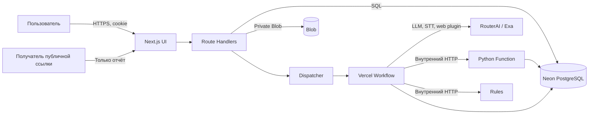
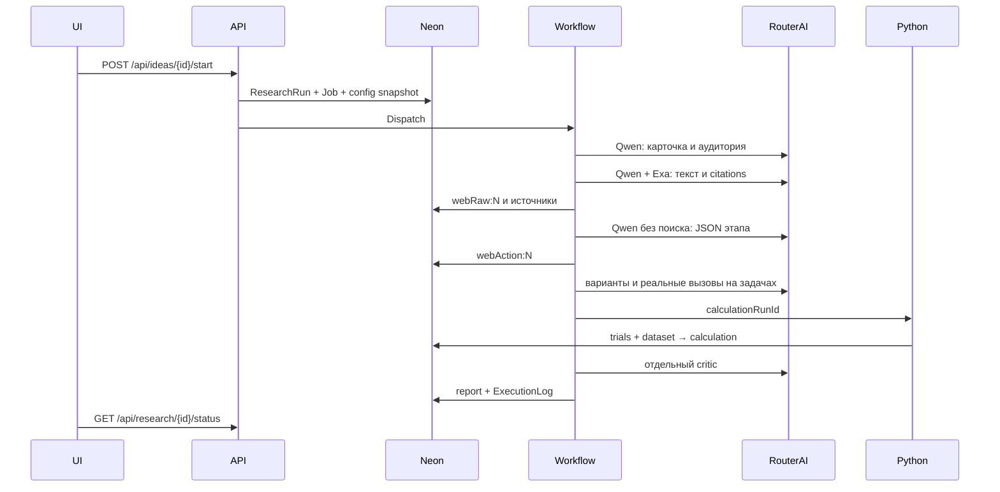

# Архитектура и поток выполнения

Текущее приложение живёт в `web`. Веб-страницы находятся в `web/app`, UI — в `web/components`, бизнес-операции и адаптеры — в `web/farm`, Python Function — в `web/api/calculate.py`. В корне остаются инструкции и документация. Целевое развертывание — один проект Vercel с внешними Neon, Private Blob и RouterAI.

## Контекст и контейнеры

`web/app/api/[...path]/route.ts` передаёт запросы в `farmApi`. Авторизация и владение объектом проверяются сервером. `db.ts` использует Neon pool; `NEON_BASE` имеет приоритет над `DATABASE_URL`. В локальной разработке `DB_DRIVER=local` включает `pg`, но в Vercel он запрещён. `next.config.ts` подключает Workflow через `withWorkflow`.

## Очередь и Workflow

Создание ResearchRun и Job происходит одной транзакцией. Снимок `policy.json` записывается в `runs.config`; смена политики не переписывает старый запуск. `dispatchNextResearchJob` держит advisory lock, выбирает один `queued` job по эффективному приоритету и FIFO, отмечает `starting` и выдаёт launch token. Приоритет растёт с ожиданием (`agingMinutes`), максимум до высокого. Зависший `starting` возвращается в очередь. Одновременно выполняется одно тяжёлое задание. При завершении Workflow вызывается следующий dispatcher; чтение статуса также вызывает reconcile.

`researchIdeaWorkflow` выполняет последовательные шаги. `boot` связывает Job с Workflow ID и запускает состояние. Успешные результаты сохраняются в `farm_steps` и при повторе пропускаются. `context` проверяет Job, launch token, актуальность идеи и версию поставщика. Пауза и отмена действуют на границах шагов; сетевой запрос, уже отправленный провайдеру, может завершиться позднее. Статус очереди отделён от стадии идеи.

## Границы компонентов

| Код | Ответственность |
| --- | --- |
| `farm/auth.ts` | Регистрация, вход, сессии, ограничение частоты, защита мутаций |
| `farm/api.ts` | HTTP-операции, проверка владельца, идемпотентные пользовательские запросы |
| `farm/dispatcher.ts` | Атомарный захват следующего Job, запуск и reconcile |
| `farm/workflow.ts`, `workflow-steps.ts` | Порядок, checkpoint и прикладные этапы |
| `farm/providers.ts` | LLMProvider и SpeechProvider на RouterAI, модели и ограничение ответов |
| `farm/execution.ts` | Резервы бюджета, повторы, ExecutionLog и данные действий |
| `farm/citations.ts` | Нормализация возвращённых citations; сервер не запрашивает страницы |
| `farm/contracts.ts`, `rules.ts` | Zod-схемы ответов и отдельно вызываемые детерминированные правила |
| `farm/storage.ts` | Проверенный аудиоввод и приватные артефакты |
| `api/calculate.py` | Численный расчёт из Neon по ID, без передачи больших данных из браузера |
| `components/CloudFarm.tsx` | Рабочее пространство, прогресс, отчёт и решение |
| `components/MvpRenderer.tsx` | Универсальная форма и вывод по MvpSpec |

Python и Rules доступны только через внутренний токен `X-Farm-Service`; `APP_ORIGIN` указывает адрес того же развертывания. Публичные методы Rules `health` и `metadata` не выполняют пользовательский сценарий.

## Версии и восстановление

Правка названия или текста создаёт `farm_idea_versions` и отмечает предыдущие runs как `stale`; исторические отчёты остаются. Порог, модель и лимиты относятся к снимку конфигурации run. Старый запуск с неподдерживаемой версией поставщика не продолжается на RouterAI незаметно: требуется новый запуск. Повтор `start` с тем же `Idempotency-Key` возвращает прежний ResearchRun; повтор результата MVP с тем же ключом не создаёт второй результат. Шаги с `unavailable` удаляются при ручном retry, остальные checkpoints остаются.

Источники отчёта, dataset, варианты, прогоны, расчёт и решение связаны через `run_id`, `idea_version_id` и ID объектов. Полная схема в [модели данных](data-model.md). Известные разрывы между целевой предметной моделью и текущими таблицами отмечены в [реестре](requirements.md).
